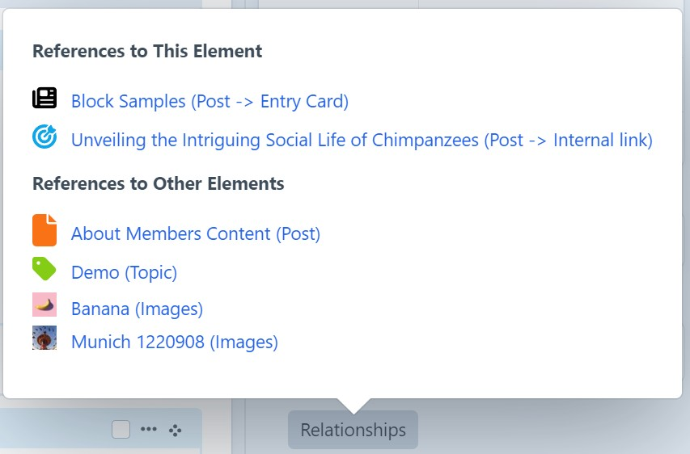
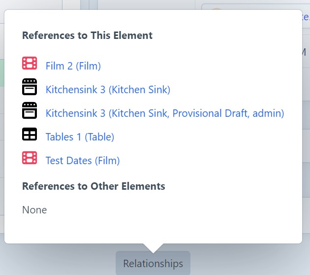
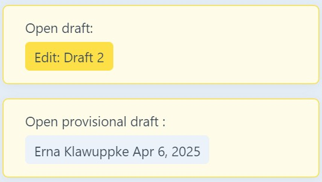
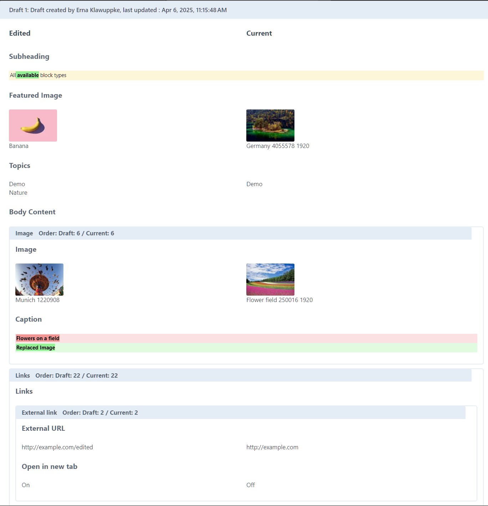
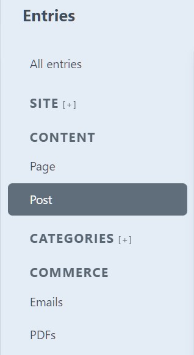
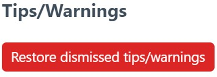
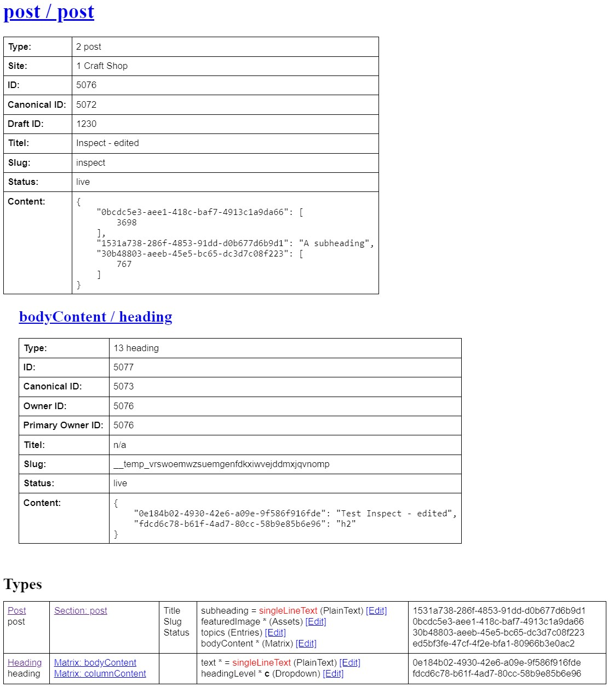

# Extras

Extra features for Craft5

This is the software equivalent of tidying up the house: “Don't throw it away, I might still need it! - But it's broken and no longer works properly! - Maybe it does? - Then at least put it all in one box!”

Readme work in progress.

## Motivation

While working on some hobby or pro bono projects with limited resources, it was not manageable to follow 'state of the art' and maintain a separate plugin/module for each feature. So started to collect all the little things that we found useful over the years in one place.

Different sources, different coding styles, different quality etc etc.

Some of the code originates from prototyping things for Craft 3, so maybe there are better ways to do it in Craft 5.

Also includes code from internship projects, just for fun coding challenges, playing around to learn new stuff, and other things that were never meant to be public.

So it's a bit of a mess, but it hey, it works!

## Requirements

This plugin requires Craft CMS 5.0.0-beta.3 or later, and PHP 8.2 or later.

## Installation

Add to `composer.json` file in your project root to require this plugin:

```json
{
  "require": {
    "wsydney76/extras": "dev-main"
  },
  "minimum-stability": "dev",
  "prefer-stable": true,
  "repositories": [
    {
      "type": "vcs",
      "url": "https://github.com/wsydney76/extras"
    }
  ]
}
```

Then run `composer update` to install the plugin.

Run `ddev craft plugin/install _extras`.

Goto `Settings -> Extras` in the control panel to enable selected functionality.

## Usage

All the functionality was built over the years for specific projects with specific requirements, and is not intended to be a comprehensive solution for all use cases. It may be useful for your project, but it may also not work as expected. Use at your own risk.

Please note that this may not work with certain element types, field types, settings, plugins like CKEditor, deeply nested content models.

Also, things may break in future versions of Craft, including minor versions, as undocumented things may be used.

No warranty, no support, no liability.

## Updates

Update: 2025-08-04: Started refactoring Elementmap (relationships) code, added Neo support. Work in progress.

Update: 2025-07-31: Provisionally added support for detecting relationships via the new Content Block field.

Update: 2025-04-14: Started some cleanup, simplified some code, removed some unused stuff, added some settings and permission checks. Not yet fully tested, but should (mostly) work.

Update: 2025-04-19: Added the Draft Package utility.

Update: 2025-04-22: Added cross-site validation.

Also pushed a Craft 5 version of the [Content Overview Plugin](https://github.com/wsydney76/craft-contentoverview/tree/craft5), that should work with this version.


### Relationships

Forked from the abandoned elementmaps plugin.

Show relationships between elements.

<div style="max-width:500px">

    

Display icons, colors, nested entry types, link to main element or nested entry. Display image thumbnails.



Also display drafts, with draft creator.

</div>


Note: While this is actually the most used feature, it is currently only used/tested in limited use cases.

In complex multi-site, multi-user, Commerce settings or deeply nested content models, it hopefully works as expected, but maybe not.

Also, it can only detect relationships in the `relations` database table, so it won't work for links created by reference tags, or in CKEditor inline links.

Only handles Craft's own element types, Products/Variants from Craft Commerce, and (on special request) the Campaign element type from Campaign plugin.


### Drafts Helpers

Originates from Craft3, where working with drafts was less transparent than today and the  requirements of projects in terms of collaboration were more important back then. But still useful.

In sidebar:
<div style="max-width:300px">



</div>

Compare drafts with the current version of the entry



Dashboard widget

<div style="max-width:300px">


</div>

Permissions required:
<div style="max-width:500px">


</div>

### Twig extensions

#### Query JSON custom fields

There was a need to query/sort by custom fields using the german phonebook collation.

```twig

```

```twig

```

#### Parameter handling

Specify params for twig files, with type checking, defaults, get query params etc.

```twig
// In include/embed:
{% do params([
    {name: 'entry', class: 'craft\\elements\\Entry', optional: true},
    {name: 'imageUrl', default: ''},
    {name: 'image', class: 'craft\\elements\\Asset', optional: true},
    {name: 'showDate', default: false, type: 'bool'},
    {name: 'showTeaser', default: false, type: 'bool'},
    {name: 'titleStyle', default: '', list: 'lg,strong', allowEmpty: true},
    {name: 'secondaryTitle', default: ''},
    {name: 'secondaryText', default: ''},
    {name: 'imagePos', default: 'right', list: 'right,left'},
    {name: 'anchor', default: ''},
]) %}

// Get from query params with default:
// Second param true: check whether the param list is complete. Relies on certain conventions

```

#### Easier

```twig
// craft.app.config.custom.facetTypes



// craft.app.request.queryParam('filter', 'all')


```

#### Pedantic German localization

```twig
// Upper 'ß' is not reliably handled by PHP/CSS uppercase
{{ 'Maße'|upperWithSz }} // -> MAẞE

// There is no 'ß' in the Swiss alphabet
{{ 'Maße'|swissText }} // -> Masse 

// Correct number formatting
// https://www.duden.de/sprachwissen/rechtschreibregeln/zahlen-und-ziffern

// No separator in numbers < 10000
{{ 1000|germanNumber }} // -> 1000

// (non-breaking) Space as thousands separator
{{ 1234567.89|germanNumber }} // -> 1 234 567,98


// Country name in addresses, sent from germany to other countries
// https://www.sekretaria.de/bueroorganisation/korrespondenz/geschaeftsbriefe/brief-ins-ausland-adressieren/
// uppercase, only german, french, english allowed

{{ postalCountryName('FR') }} // -> FRANKREICH
{{ postalCountryName('FR', 'es') }} // -> FRANCE

```
### Misc

#### Element index sidebar

Make element index sections collapsible (useful for large sites with many sections)

<div style="max-width:200px">



</div>

#### Restore dismissed tipps/warnings

<div style="max-width:250px">



</div>

#### Enable Action Routes

Enable section template settings to point to a custom controller, in the form of "action:module/controller/action"

#### Enable Cross-site Validation

Craft does not validate entries across sites, so if you have a multi-site setup, you may end up with entries that are not valid in all sites.

Enable this to validate entries across sites.

Note: Provisionally ported from Craft3, needs fixing (or a FR/Bug report on Craft's side...) Duplicate error messages are shown now.

#### Owner Path

For nested entries, retrieve the owner entries for each level on the path to the top level entry.

Partially superseded by Craft's `getRootOwner()` method.

There is also an element index column for this. (Experimental, buggy)


```twig

// Full path


// Top level only


```

#### Element Actions

Enable to add `Copy reference tag with link` and `Copy reference tag with markdown link` to the element actions menu.

#### Conditions

Enable conditions for element index.

Experimental.

* All Types: Allows to filter by all entry types, including nested ones.
* Is Edited: Filter your provisional drafts.
* My Drafts: Filter all your drafts.

#### Field Layout Elements

* `Instruction`: Superseded by Craft's own `Markdown` field layout element.

#### Collection Macros

Enable to add a `addToCollection` macro to collections.

Manages a collection key that holds an array of items.

The key will be created if it does not exist.

Example: Collect all images for a copyright notice in the footer.

```twig

```

#### Styles

Enable CP assets to apply some custom styles to the control panel.

Enhances font size, makes toast messages stand out, darkens colors etc.

Additionally, you can choose a custom font-size.

Add a `extrasFontSize` plain text custom field to the user field layout, and let each user choose the font size. This is useful for users with visual impairments.

#### Extras variable

Enables `craft._extras` variable. Superseded by Craft's `fieldValueSql` function.

#### CKEditor plugins

Enable selected additional CKEditor plugins.

* Highlight: Highlight text in the editor, useful for marking text. Add the 'Highlight' button to the toolbar in the field settings.
  In order to use this, you have to provide a custom CSS file that defines the styles for the highlight classes.

E.g.

```css
mark.pen-red {
    color: red;
}
mark.pen-green {
    color: green;
}
mark.marker-yellow {
    background-color: yellow !important;
}
mark.marker-green {
    background-color: green  !important;
    color: white;
}
mark.marker-pink{
    background-color: pink  !important;
}
mark.marker-blue{
    background-color: blue  !important;
    color: white;
}
```

* Mentions: Enables smart autocompletion based on user input.
  This requires a CKEditor config setting that defines the mention items. See [docs](https://ckeditor.com/docs/ckeditor5/latest/features/mentions.html).

Options can be dynamically loaded via an event:


```php
use craft\ckeditor\Field;
...
Event::on(
    Field::class,
    Field::EVENT_MODIFY_CONFIG,
    function(ModifyConfigEvent $event) {
        if ($event->sender->handle !== 'body' || $event->ckeConfig->name !== 'Simple') {
            return;
        }

        $event->ckeConfig->options['mention'] = [
            'feeds' => [
                [
                    'feed' => Entry::find()
                        ->section('company')
                        ->collect()
                        ->map(fn($entry) =>
                        [
                            'id' => '@' . strstr($entry->email, '@', true),
                            'text' => "$entry->title ($entry->email)",
                        ]
                        ),
                    'marker' => '@',
                    'minimumCharacters' => 2,
                ],
            ],
        ];


    }
);
```

where `id` is the value that triggers the mention, and `text` is what will be inserted.

Add CSS to style the mentions, if required:

```css
span.mention {
    background-color: #eeeeee;
}
```

### CLI

Check for runtime errors in templates. Also forces the creation of image transforms, if the `generateTransformsBeforePageLoad` config setting is enabled.

```bash
ddev craft _extras/quality/check-runtime-errors
ddev craft _extras/quality/check-runtime-errors -c // Commerce
```

Check for missing asset files (local filesystem only)

```bash
ddev craft _extras/quality/check-asset-files
```
Check if entries still validate. Useful after config changes or updated validation rules.

```bash
ddev craft _extras/quality/validate
```

Set missing mimetypes for assets. This is useful after upgrading to Craft 5.8, as it introduced a new mimetype detection mechanism that may not have been applied to existing assets.

```bash
ddev craft _extras/quality/set-missing-mimetypes
```

Craft 5 migration, detect merge candidates for field instances. Superseded by Craft's own migration tool.

```bash
craft _extras/fields/merge-candidates
```

Experimental: Replace global field used by a field instance. As Craft only allows to overwrite a few field properties, it may be necessary to replace the underlying global field with a new one.
Caution: This is a just for fun coding challenge, not a production ready solution. Use at your own risk.

```bash
ddev craft _extras/fields/replace-field <entryTypeHandle> <fromFieldInstanceHandle> <toFieldHandle>
```

Retrieve json sql for a field instance. This is useful for debugging.

```bash
ddev craft _extras/json-custom-field/dump-field subheading
```

```mysql
COALESCE(CAST((`elements_sites`.`content`->>'$.\"1531a738-286f-4853-91dd-d0b677d6b9d1\"') AS CHAR(255)), CAST((`elements_sites`.`content`->>'$.\"f2231d84-26f5-4ace-9640-af7d2c33a631\"') AS CHAR(255)))
```

Experimental: Create functional index for json custom field.

```bash
ddev craft _extras/json-custom-field/create-functional-index person.lastName
```

In our typical setup with not so much data, this doesn't improve performance significantly, so not finally tested. But if you have a lot of data and complex queries, this may be useful.

### Services

#### BaseContentService

Create entry, e.g. for testing, dummy content, or simple content migrations

Note: This is not meant as a comprehensive solution for content migration, but rather as a quick way for simple use cases

```php
use wsydney76\extras\base\services\BaseContentService;
...
$service = new BaseContentService();

$service->createEntry([
    'section' => 'post',
    'type' => 'post',
    'author' => User::find()->admin()->one(),
    'title' => 'This is a test post',
    'fields' => [
        'subheading' => 'This is a test subheading',
        'featuredImage' => [722],
        'topics' => [767],
        'bodyContent' => [
            [
                'type' => 'text',
                'fields' => [
                    'text' => 'This is a test text field',
                ]
            ],
            [
                'type' => 'heading',
                'fields' => [
                    'text' => 'This is a test heading field',
                    'headingLevel' => 'h2',
                ]
            ],
            [
                'type' => 'image',
                'fields' => [
                    'image' => [722],
                    'caption' => 'This is a test caption',
                ]
            ]
        ]
    ],
    'localized' => [
        'de' => [
            'title' => 'Dies ist ein Testbeitrag',
            'slug' => 'dies-ist-ein-testbeitrag',
            'fields' => [
                'subheading' => 'Dies ist eine Testunterüberschrift',
                'bodyContent' => [
                    // ... matrix blocks in the same order as the default locale
                ]
            ]
        ]
    ]
]);
```

#### VideoService

Video service: Create video poster from video

```php
use wsydney76\extras\services\VideoService;
...
$service = new VideoService();
$video = Asset::findOne(4955);
$service->createVideoPoster($video);
```

Requires ffmpeg to be installed and available in the PATH, and an asset field in the field layout for the volume where the video is stored.

In `.ddev/config.yaml`: `webimage_extra_packages: [ ffmpeg ]`, 

In `composer.json` require: `"php-ffmpeg/php-ffmpeg": "^1.1",`.

Signature `public function createVideoPoster(Asset $video, int $fromSeconds = 1, bool $replace = false, string $posterField = 'videoPoster'): bool`

### Base module

A module class can extend this one to register components in a unified way without using complex event listeners.

Internship project back in Craft3 days, upgrade to Craft 5 incomplete, life is simpler now that Craft generator can be used.

```php
class MainModule extends BaseModule 
...
protected string $handle = 'main';
...
$this->registerBehaviors(Entry::class, [
    EntryBehavior::class,
]);

$this->registerFieldTypes([
    SiteField::class,
    IncludeField::class,
    SectionField::class,
]);

$this->registerCraftVariableServices([
    ['project', ProjectService::class],
]);

$this->registerTwigExtensions([
    TwigExtension::class,
]);
```

### Utilities

#### Upgrade Inventory

Helped for upgrading projects with a lot of fields from Craft 4 to Craft 5.

Shows fields, entry types and helps find merge candidates.

Lessons learned: Be very conservative with merging fields...

#### Volumes Inventory

All volumes/file systems at a glance,

#### Draft Package Utility

Experimental. A Utility to apply a package of drafts at once.

Note: Once upon a time, this has been created as a quick and dirty solution for a specific project, especially only handles `Entry` element type, and has never been tested in a multi-site environment.

Provisionally ported to Craft 5.

Craft lacks a functionality that allows to publish a number of drafts at once. This is a very simplified workaround for this:

* Create a section for draft packages (default handle: `draftPackage`)
* Create an entries field (default handle: `draftPackage`) applied to all relevant entry types.
* Create a package entry, and let all drafts point to this entry.
* Use the utility to publish all drafts at once.

Craft does not allow newly created entries to be the target of a relation, so if this is needed:

* Create and save a new entry in a `disabled` state
* Now other entries can point to this entry
* Create a new draft for this entry, set to `enabled`

### Live Preview

The 'Inspect' live preview dumps the entry and nested entry data incl JSON custom fields. This is useful for debugging and testing.



### JavaScript Actions

Call web controller actions via JavaScript and display success or error notices.

Usage

Twig:

```twig

```

JavaScript:

```javascript
window.Actions.postAction("mymodule/mycontroller/myaction",
    {'id': 1234},
    (data) => {
        window.Actions.success(data.message);
    }
);
```

See [ACTIONS.md](ACTIONS.md) for details.