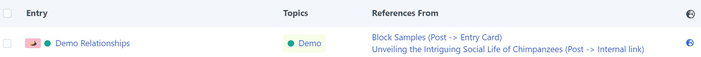

# Extras

Extra features for Craft5

This is the software equivalent of tidying up the house: “Don't throw it away, I might still need it! - But it's broken and no longer works properly! - Maybe it does? - Then at least put it all in one box!”

Readme work in progress.

## Requirements

This plugin requires Craft CMS 5.0.0-beta.3 or later, and PHP 8.2 or later.

## Installation

Add to `composer.json` file in your project root to require this plugin:

```json
{
  "require": {
    "wsydney76/extras": "dev-main"
  },
  "minimum-stability": "dev",
  "prefer-stable": true,
  "repositories": [
    {
      "type": "vcs",
      "url": "https://github.com/wsydney76/extras"
    }
  ]
}
```

Then run `composer update` to install the plugin.

Goto `Settings -> Extras` in the control panel to enable selected functionality.

## Usage

### Relationships

Forked from the abandoned elementmaps plugin.

Show relationships between elements. 

Please note that this may not work with certain element types, field types, plugins like CKEditor, deeply nested content models.

(Intentionally vague, as only tested for our setups)




### Drafts Helpers

Originates from Craft3, where working with drafts was less transparent than today and the  requirements of projects in terms of collaboration were more important back then. But still useful.

In sidebar:


Compare drafts with the current version of the entry


Dashboard widget


Permissions required:


### Misc

Make element index sections collapsible (useful for large sites with many sections)


Restore dismissed tipps/warnings


Enable Action Routes: Enable section template settings to point to a custom controller, in the form of "action:module/controller/action"

### Twig extensions

Query JSON custom fields, with specific collation

```twig

```

```twig

```

Specify params for twig files, with type checking, defaults, get query params etc.

```twig
// In include/embed:
{% do params([
    {name: 'entry', class: 'craft\\elements\\Entry', optional: true},
    {name: 'imageUrl', default: ''},
    {name: 'image', class: 'craft\\elements\\Asset', optional: true},
    {name: 'showDate', default: false, type: 'bool'},
    {name: 'showTeaser', default: false, type: 'bool'},
    {name: 'titleStyle', default: '', list: 'lg,strong', allowEmpty: true},
    {name: 'secondaryTitle', default: ''},
    {name: 'secondaryText', default: ''},
    {name: 'imagePos', default: 'right', list: 'right,left'},
    {name: 'anchor', default: ''},
]) %}

// Get from query params with default:

```

Easier

```twig
// craft.app.config.custom.facetTypes



// craft.app.request.queryParam('filter', 'all')


```

Pedantic localization of German texts

```twig
// Upper 'ß' is not reliably handled by PHP/CSS uppercase
{{ 'Maße'|upperWithSz }} // -> MAẞE

// There is no 'ß' in the Swiss alphabet
{{ 'Maße'|swissText }} // -> Masse 

// Correct number formatting
// https://www.duden.de/sprachwissen/rechtschreibregeln/zahlen-und-ziffern

// No separator in numbers < 10000
{{ 1000|germanNumber }} // -> 1000

// (non-breaking) Space as thousands separator
{{ 1234567.89|germanNumber }} // -> 1 234 567,98


// Country name in addresses, sent from germany to other countries
// https://www.sekretaria.de/bueroorganisation/korrespondenz/geschaeftsbriefe/brief-ins-ausland-adressieren/
// uppercase, only german, french, english allowed

{{ postalCountryName('FR') }} // -> FRANKREICH
{{ postalCountryName('FR', 'es') }} // -> FRANCE

```

### CLI

Check for runtime errors in templates. Also forces the creation of image transforms, if the `generateTransformsBeforePageLoad` config setting is enabled.

```bash
ddev craft _extras/quality/check-runtime-errors
ddev craft _extras/quality/check-runtime-errors -c // Commerce
```

Check for missing asset files (local filesystem only)

```bash
ddev craft _extras/quality/check-asset-files
```
Check if entries still valide. Useful after config changes or updated validation rules.

```bash
ddev craft _extras/quality/validate
```

Craft 5 migration, detect merge candidates for field instances. Superseded by Craft's own migration tool.

```bash
craft _extras/fields/merge-candidates
```

Craft 5 migration, detect merge candidates for field instances. Superseded by Craft's own migration tool.

```bash
craft _extras/fields/merge-candidates
```

Experimental: Replace global field used by a field instance. As Craft only allows to overwrite a few field properties, it may be necessary to replace the underlying global field with a new one.
Caution: This is a just for fun coding challenge, not a production ready solution. Use at your own risk.

```bash
ddev craft _extras/fields/replace-field <entryTypeHandle> <fromFieldInstanceHandle> <toFieldHandle>
```

Retrieve json sql for a field instance. This is useful for debugging.

```bash
ddev craft _extras/json-custom-field/dump-field subheading
```

```sql
COALESCE(CAST((`elements_sites`.`content`->>'$.\"1531a738-286f-4853-91dd-d0b677d6b9d1\"') AS CHAR(255)), CAST((`elements_sites`.`content`->>'$.\"f2231d84-26f5-4ace-9640-af7d2c33a631\"') AS CHAR(255)))
```

Experimental: Create functional index for json custom field.

```bash
ddev craft _extras/json-custom-field/create-functional-index person.lastName
```

In our typical setup with not so much data, this doesn't improve performance significantly, so not finally tested. But if you have a lot of data and complex queries, this may be useful.

### Services

Create entry, e.g. for testing, dummy content, or simple content migrations

Note: This is not meant as a comprehensive solution for content migration, but rather as a quick way for simple use cases

```php
use wsydney76\extras\base\services\BaseContentService;
...
$service = new BaseContentService();

$service->createEntry([
    'section' => 'post',
    'type' => 'post',
    'author' => User::find()->admin()->one(),
    'title' => 'This is a test post',
    'fields' => [
        'subheading' => 'This is a test subheading',
        'featuredImage' => [722],
        'topics' => [767],
        'bodyContent' => [
            [
                'type' => 'text',
                'fields' => [
                    'text' => 'This is a test text field',
                ]
            ],
            [
                'type' => 'heading',
                'fields' => [
                    'text' => 'This is a test heading field',
                    'headingLevel' => 'h2',
                ]
            ],
            [
                'type' => 'image',
                'fields' => [
                    'image' => [722],
                    'caption' => 'This is a test caption',
                ]
            ]
        ]
    ],
    'localized' => [
        'de' => [
            'title' => 'Dies ist ein Testbeitrag',
            'slug' => 'dies-ist-ein-testbeitrag',
            'fields' => [
                'subheading' => 'Dies ist eine Testunterüberschrift',
                'bodyContent' => [
                    // ... matrix blocks in the same order as the default locale
                ]
            ]
        ]
    ]
]);
```

Video service: Create video poster from video

```php
use wsydney76\extras\services\VideoService;
...
$service = new VideoService();
$video = Asset::findOne(4955);
$service->createVideoPoster($video);
```

Requires ffmpeg to be installed and available in the PATH, and an asset field in the field layout for the volume where the video is stored.

in `.ddev/config.yaml`: `webimage_extra_packages: [ ffmpeg ]`, in `composer.json` require: `"php-ffmpeg/php-ffmpeg": "^1.1",`.

Signature `public function createVideoPoster(Asset $video, int $fromSeconds = 1, bool $replace = false, string $posterField = 'videoPoster'): bool`

### Base module

A module class can extend this one to register components in a unified way without using complex event listeners.

Internship project back in Craft3 days, upgrade to Craft 5 incomplete, life is simpler now that Craft generator can be used.

```php
class MainModule extends BaseModule 
...
protected string $handle = 'main';
...
$this->registerBehaviors(Entry::class, [
    EntryBehavior::class,
]);

$this->registerFieldTypes([
    SiteField::class,
    IncludeField::class,
    SectionField::class,
]);

$this->registerCraftVariableServices([
    ['project', ProjectService::class],
]);

$this->registerTwigExtensions([
    TwigExtension::class,
]);
```

### Live Preview

The 'Inspect' live preview dumps the entry and nested entry data incl JSON custom fields. This is useful for debugging and testing.

